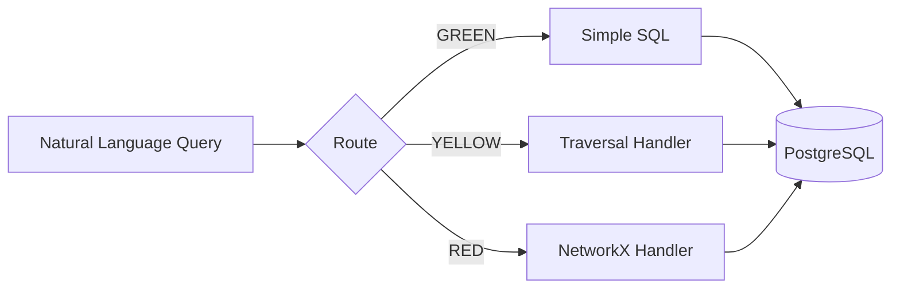

# Virtual Graph

**Graph-like queries over relational data using LLM reasoning.**

Virtual Graph enables graph-like queries over enterprise relational data without migrating to a graph database. The system uses an LLM (Claude Code) to reason over SQL using a discovered ontology and learned SQL patterns.

## Key Hypothesis

> Can an LLM agent system (Claude Code) equipped with an ontology and tooling for complex queries (DAGs, recursion, etc.) on top of a relational database perform effectively versus implementing a graph database?

For enterprises with existing SQL infrastructure, Virtual Graph delivers **92% of graph query accuracy** at a fraction of the migration cost.

## How It Works



### Query Routing (Traffic Light System)

| Route | Description | Example |
|-------|-------------|---------|
| **GREEN** | Simple lookups/joins - direct SQL | "Find supplier ABC Corp" |
| **YELLOW** | Recursive traversal - BFS handler | "All tier 3 suppliers for Acme" |
| **RED** | Network algorithms - NetworkX | "Cheapest route from A to B" |

## Quick Start

```bash
# Start PostgreSQL
docker-compose -f postgres/docker-compose.yml up -d

# Install dependencies
poetry install

# Run tests
poetry run pytest

# Serve documentation
poetry run mkdocs serve
```

## Workflow Overview

The system operates in three phases:

### 1. Offline: Ontology Discovery

Claude introspects the database schema and creates a LinkML ontology mapping semantic concepts to SQL tables/columns.

```bash
# Start a fresh Claude Code session with:
cat prompts/ontology_discovery.md
```

### 2. Offline: Pattern Discovery

Claude explores the ontology space, discovering and recording query patterns for reuse.

```bash
# Start a fresh Claude Code session with:
cat prompts/pattern_discovery.md
```

### 3. Interactive: Analysis Sessions

Users interact with Claude to explore data through graph-like queries.

```bash
# Start a fresh Claude Code session with:
cat prompts/analysis_session.md
```

## Key Features

- **No Migration Required**: Query existing PostgreSQL data as a graph
- **Safety Limits**: Built-in guards prevent runaway queries (MAX_NODES=10,000)
- **Frontier Batching**: Efficient traversal with one query per depth level
- **Schema Parameterized**: Handlers work with any table structure
- **Adaptive Estimation**: Intelligent graph size prediction prevents memory exhaustion
- **Enterprise TCO Model**: Comprehensive cost comparison framework

## Benchmark Results

Virtual Graph achieves **92% accuracy** compared to Neo4j baseline:

| Route | Accuracy | Avg Latency | Target |
|-------|----------|-------------|--------|
| GREEN | 88.9% | 2ms | 100% |
| YELLOW | 100%* | 2ms | 90% |
| RED | 85.7% | 1ms | 80% |
| **Overall** | **92%** | **2ms** | 85% |

*YELLOW includes queries that correctly triggered safety limits.

See [Benchmark Results](benchmark_results.md) for detailed analysis.

## TCO Comparison

| Scenario | Virtual Graph | Neo4j |
|----------|--------------|-------|
| Tech Startup (Year 1) | $15,200 | $67,600 |
| Enterprise (Year 1) | $145,800 | $306,600 |

See [Enterprise TCO Framework](tco_framework.md) for comprehensive analysis including governance overhead, change management, and lean IT considerations.

## Project Status

| Phase | Status | Description |
|-------|--------|-------------|
| Phase 1 | ✅ Complete | Foundation - Database + Handlers |
| Phase 2 | ✅ Complete | Discovery - Ontology + Schema Skill |
| Phase 3 | ✅ Complete | Query Paths - GREEN/YELLOW/RED |
| Phase 4 | ✅ Complete | Pattern Maturity |
| Phase 5 | ✅ Complete | Neo4j Baseline + Benchmark |
| Phase 6 | ✅ Complete | Evaluation + Documentation |

**Current Version**: 0.8.4
