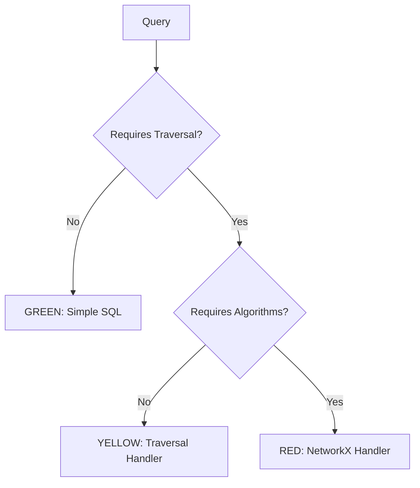

# Query Routing

Virtual Graph uses a "traffic light" system to route queries based on complexity.

## Traffic Light System



## GREEN Path - Simple SQL

**Characteristics:**

- Direct lookups by ID or name
- 1-2 hop joins via foreign keys
- Standard aggregations
- No recursive traversal

**Examples:**

| Query | SQL Pattern |
|-------|-------------|
| "Find supplier ABC Corp" | `SELECT * FROM suppliers WHERE name = 'ABC Corp'` |
| "List all tier 1 suppliers" | `SELECT * FROM suppliers WHERE tier = 1` |
| "Parts from supplier X" | `SELECT p.* FROM parts p WHERE p.primary_supplier_id = ?` |
| "Facilities in California" | `SELECT * FROM facilities WHERE state = 'CA'` |

**No handler needed** - LLM generates SQL directly using ontology mappings.

## YELLOW Path - Recursive Traversal

**Characteristics:**

- Variable depth traversal
- Path tracking required
- Stop conditions
- Relationship chains

**Examples:**

| Query | Handler | Key Params |
|-------|---------|------------|
| "All tier 3 suppliers for X" | `traverse` | direction=inbound, stop=tier=3 |
| "Upstream suppliers of Y" | `traverse` | direction=inbound |
| "Full BOM for product P" | `traverse` | outbound through BOM edges |
| "Impact if supplier S fails" | `traverse` | Reverse traversal |

**Uses `traverse()` handler** with frontier-batched BFS.

## RED Path - Network Algorithms

**Characteristics:**

- Weighted edges
- Global graph properties
- Path optimization
- Centrality analysis

**Examples:**

| Query | Handler | Notes |
|-------|---------|-------|
| "Cheapest route from A to B" | `shortest_path` | weight_col=cost_usd |
| "Shortest path between facilities" | `shortest_path` | weight_col=distance_km |
| "Most critical facility" | `centrality` | type=betweenness |
| "Most connected supplier" | `centrality` | type=degree |

**Uses NetworkX handlers** - loads subgraph into memory for algorithms.

## Routing Decision Tree

```
1. Does the query mention specific entities by name/ID?
   → GREEN (lookup)

2. Does the query involve counting, summing, or averaging?
   → GREEN (aggregation)

3. Does the query mention "all", "every", "recursive", or traversal terms?
   → YELLOW (traversal)

4. Does the query mention paths, routes, shortest, cheapest?
   → RED (pathfinding)

5. Does the query mention important, critical, central, connected?
   → RED (network analysis)
```

## Complexity Indicators

### GREEN Indicators

- "find", "get", "show", "list"
- Specific entity names
- Simple filters (by country, tier, category)
- "how many", "total", "average"

### YELLOW Indicators

- "all suppliers for", "all components of"
- "upstream", "downstream"
- "chain", "hierarchy", "tree"
- "affected by", "depends on"
- Tier/level traversal

### RED Indicators

- "shortest", "cheapest", "fastest"
- "route", "path between"
- "most important", "critical"
- "connected", "central"
- "bottleneck", "single point of failure"

## Performance Characteristics

| Route | Typical Latency | Memory Usage |
|-------|----------------|--------------|
| GREEN | <100ms | Minimal |
| YELLOW | <2s | O(visited nodes) |
| RED | <5s | O(subgraph size) |

## Safety Considerations

All routes enforce safety limits:

- **GREEN**: Database query timeout (30s)
- **YELLOW**: MAX_NODES (10,000) checked before traversal
- **RED**: Subgraph size checked before NetworkX load
