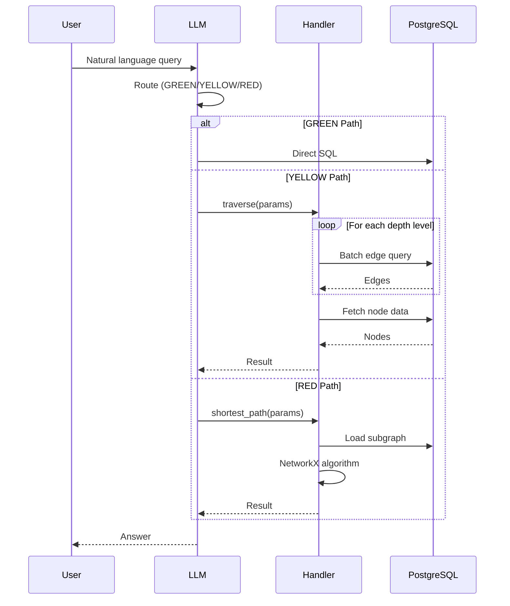

# Architecture Overview

Virtual Graph enables graph-like queries over relational data by combining:

1. **Discovered Ontology** - Semantic mappings from business concepts to SQL
2. **Learned Patterns** - SQL templates for common graph operations
3. **Generic Handlers** - Schema-parameterized graph algorithms

## System Architecture

```
┌─────────────────────────────────────────────────────────────────────────┐
│                         CLAUDE CODE SESSION                              │
├─────────────────────────────────────────────────────────────────────────┤
│                                                                          │
│  ┌─────────────────────────────────────────────────────────────────┐    │
│  │                    CONTEXT MANAGEMENT                            │    │
│  │                                                                  │    │
│  │   ALWAYS LOADED              ON-DEMAND (Skills)                 │    │
│  │   ┌──────────────┐          ┌──────────────┐                    │    │
│  │   │  Ontology    │          │   Patterns   │                    │    │
│  │   │  (semantic   │          │   (learned   │                    │    │
│  │   │   mappings)  │          │    SQL)      │                    │    │
│  │   └──────────────┘          └──────────────┘                    │    │
│  │                              ┌──────────────┐                    │    │
│  │                              │   Schema     │                    │    │
│  │                              │ (introspect) │                    │    │
│  │                              └──────────────┘                    │    │
│  └─────────────────────────────────────────────────────────────────┘    │
│                                                                          │
│  ┌─────────────────────────────────────────────────────────────────┐    │
│  │                    GENERIC HANDLERS                              │    │
│  │                    (schema-parameterized)                        │    │
│  │                                                                  │    │
│  │   traverse(nodes_table, edges_table, fk_from, fk_to,            │    │
│  │            direction, stop_condition, max_depth)                 │    │
│  │                                                                  │    │
│  │   shortest_path(nodes_table, edges_table, weight_col,           │    │
│  │                 start_id, end_id)                                │    │
│  │                                                                  │    │
│  │   centrality(nodes_table, edges_table, centrality_type)         │    │
│  │                                                                  │    │
│  └─────────────────────────────────────────────────────────────────┘    │
│                                                                          │
│  ┌─────────────────────────────────────────────────────────────────┐    │
│  │                         PostgreSQL                               │    │
│  └─────────────────────────────────────────────────────────────────┘    │
│                                                                          │
└─────────────────────────────────────────────────────────────────────────┘
```

## Core Principles

### 1. Schema Parameterization

Handlers know nothing about specific domains (suppliers, parts, etc.). They only understand:

- Table names
- Column names
- Foreign key relationships

This makes them reusable across any relational schema.

### 2. Frontier Batching

**Mandatory pattern**: One SQL query per depth level, never per node.

```python
# GOOD: Batch query for entire frontier
SELECT * FROM edges WHERE from_col = ANY(frontier_ids)

# BAD: Query per node (N+1 problem)
for node_id in frontier:
    SELECT * FROM edges WHERE from_col = node_id
```

### 3. Hybrid SQL/Python

- **Python orchestrates** - Manages traversal state, paths, visited sets
- **SQL filters** - Efficient batch queries with database indexes
- **Never bulk load** - Don't load entire tables into memory

### 4. Safety First

Non-negotiable limits prevent runaway queries:

| Limit | Value | Purpose |
|-------|-------|---------|
| MAX_DEPTH | 50 | Prevent infinite recursion |
| MAX_NODES | 10,000 | Bound memory usage |
| MAX_RESULTS | 1,000 | Limit response size |
| QUERY_TIMEOUT | 30s | Prevent long-running queries |

## Data Flow



## Component Responsibilities

| Component | Responsibility |
|-----------|----------------|
| **Ontology** | Map business concepts to SQL tables/columns |
| **Patterns** | Provide SQL templates for common operations |
| **Schema Skill** | Introspect database for physical details |
| **Handlers** | Execute graph algorithms efficiently |
| **LLM** | Route queries, parameterize handlers |

## Ontology Format

The ontology uses **LinkML format with Virtual Graph extensions**:

```yaml
# Entity classes use vg:SQLMappedClass
Supplier:
  instantiates: [vg:SQLMappedClass]
  annotations:
    vg:table: suppliers
    vg:primary_key: id

# Relationship classes use vg:SQLMappedRelationship
SuppliesTo:
  instantiates: [vg:SQLMappedRelationship]
  annotations:
    vg:edge_table: supplier_relationships
    vg:domain_key: seller_id
    vg:range_key: buyer_id
    vg:traversal_complexity: YELLOW
```

Two-layer validation:
1. **LinkML structure**: `poetry run linkml-lint --validate-only`
2. **VG annotations**: `OntologyAccessor(validate=True)`
