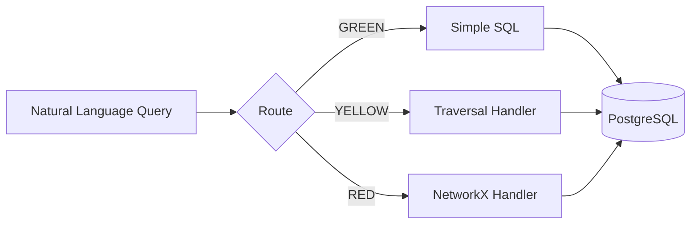

# Virtual Graph Overview

**Graph-like queries over relational data using LLM reasoning.**

Virtual Graph enables graph-like queries over enterprise relational data without migrating to a graph database. The system uses an LLM (Claude) to reason over SQL using a discovered ontology and learned query patterns.

## The Research Question

> Can an LLM agent system equipped with an ontology and tooling for complex queries (DAGs, recursion, etc.) on top of a relational database perform effectively versus implementing a graph database?

For enterprises with existing SQL infrastructure, this question is critical. Graph databases offer powerful query capabilities, but migration carries significant cost and risk.

## Key Hypothesis

Virtual Graph tests whether **semantic layer + intelligent routing** can deliver graph-like capabilities without graph infrastructure:

```
┌─────────────────────────────────────────────────────────────────┐
│                     VIRTUAL GRAPH HYPOTHESIS                     │
├─────────────────────────────────────────────────────────────────┤
│                                                                  │
│   Ontology          +    Handler Library    =    Graph Queries  │
│   (semantic map)         (SQL generators)        (over SQL)     │
│                                                                  │
│   ┌──────────────┐       ┌──────────────┐       ┌────────────┐ │
│   │  Classes     │       │  traverse()  │       │ "Find all  │ │
│   │  Relationships│  +    │  shortest_   │   =   │  tier 3    │ │
│   │  Annotations │       │    path()    │       │  suppliers"│ │
│   └──────────────┘       └──────────────┘       └────────────┘ │
│                                                                  │
└─────────────────────────────────────────────────────────────────┘
```

## How It Works

Virtual Graph routes queries through three paths based on complexity:



### Traffic Light Routing

| Route | Description | Example |
|-------|-------------|---------|
| **GREEN** | Simple lookups/joins - direct SQL | "Find supplier ABC Corp" |
| **YELLOW** | Recursive traversal - BFS handler | "All tier 3 suppliers for Acme" |
| **RED** | Network algorithms - NetworkX | "Cheapest route from A to B" |

See [Architecture](architecture.md) for detailed routing rules.

## The Three-Phase Workflow

Virtual Graph operates in three phases:

### Phase 1: Ontology Discovery (Offline)

Claude introspects the database schema and creates a LinkML ontology mapping semantic concepts to SQL tables/columns.

*For your domain: Run ontology discovery once per database schema.*

### Phase 2: Pattern Discovery (Offline)

Claude explores the ontology space, discovering and recording query patterns for reuse.

*For your domain: Build pattern library iteratively as you explore queries.*

### Phase 3: Analysis Sessions (Interactive)

Users interact with Claude to explore data through graph-like queries, using the ontology and patterns.

*For your domain: This is the primary usage mode.*

See [Workflow](../workflow/overview.md) for detailed process documentation.

## Key Design Principles

### 1. No Migration Required

Query existing PostgreSQL data as a graph. No ETL pipelines, no data duplication, no sync lag.

### 2. Safety First

Built-in guards prevent runaway queries:
- `MAX_NODES = 10,000` - Limits traversal scope
- `MAX_DEPTH = 50` - Prevents infinite recursion
- `QUERY_TIMEOUT = 30s` - Bounds execution time

### 3. Frontier Batching

Efficient traversal with one SQL query per depth level, not one query per node.

### 4. Schema Parameterized

Handlers work with any table structure. The ontology provides the mapping.

### 5. Adaptive Estimation

Intelligent graph size prediction prevents memory exhaustion before traversal begins.

## Current Results

Virtual Graph achieves **92% accuracy** compared to Neo4j baseline:

| Route | Accuracy | Avg Latency | Target |
|-------|----------|-------------|--------|
| GREEN | 88.9% | 2ms | 100% |
| YELLOW | 100%* | 2ms | 90% |
| RED | 85.7% | 1ms | 80% |
| **Overall** | **92%** | **2ms** | 85% |

*YELLOW includes queries that correctly triggered safety limits.

## When Virtual Graph Fits

Virtual Graph is designed for enterprises that:

- Have significant investment in relational databases
- Need graph-like query capabilities (not native graph)
- Can accept 90%+ accuracy with safety limits
- Value real-time data access
- Want to avoid new infrastructure costs

See [When to Use](when-to-use.md) for detailed decision criteria.

## Project Components

| Component | Purpose | Location |
|-----------|---------|----------|
| **Ontology** | Semantic mapping to SQL | `ontology/` |
| **Handlers** | Graph operation executors | `src/virt_graph/handlers/` |
| **Estimator** | Size prediction & guards | `src/virt_graph/estimator/` |
| **Patterns** | Reusable query templates | `patterns/templates/` |
| **Skills** | On-demand context loaders | `.claude/skills/` |
