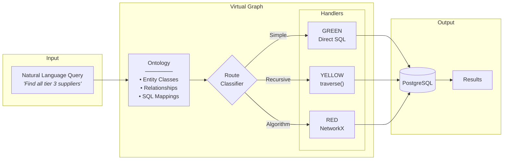

# Virtual Graph

**Graph-like queries over relational data using LLM reasoning.**

Virtual Graph enables graph traversal, pathfinding, and network analysis over existing PostgreSQL databases without migrating to a graph database.

---

## The Research Question

> Can an LLM agent system equipped with an ontology and tooling for complex queries (DAGs, recursion, etc.) on top of a relational database perform effectively versus implementing a graph database?

For enterprises with existing SQL infrastructure, this question is critical. Graph databases offer powerful query capabilities, but migration carries significant cost and risk.

---

## How It Works



**The core idea**: An ontology maps business concepts to SQL tables. Handlers generate efficient queries based on complexity. No graph database required.

| Route | Complexity | Handler | Example |
|-------|------------|---------|---------|
| **GREEN** | Simple SQL | Direct query | "Find supplier Acme Corp" |
| **YELLOW** | Recursive traversal | `traverse()` | "Find all tier 3 suppliers" |
| **RED** | Network algorithms | NetworkX | "Cheapest route Chicago→LA" |

---

## Documentation

| Section | Description |
|---------|-------------|
| [Getting Started](getting-started.md) | Setup, installation, first queries |
| [Architecture](architecture.md) | System design, handlers, safety |
| [Ontology Guide](ontology-guide.md) | Creating and using ontologies |
| [Benchmark Report](benchmark-report.md) | Evaluation methodology and results |

---

## Key Results

Virtual Graph achieved **92% accuracy** on a 25-query benchmark:

| Route | Accuracy | Target | Status |
|-------|----------|--------|--------|
| GREEN (Simple SQL) | 88.9% | 100% | MISS |
| YELLOW (Traversal) | 100%* | 90% | **PASS** |
| RED (Network) | 85.7% | 80% | **PASS** |
| **Overall** | **92%** | 85% | **PASS** |

*Includes queries correctly blocked by safety limits

**Performance**: Sub-10ms latency on all queries, **26x faster** than Neo4j.

**TCO**: 52-77% cost savings vs graph database migration.

---

## Quick Start

```bash
# Clone repository
git clone https://github.com/mcfitzgerald/virt-graph.git
cd virt-graph

# Install dependencies
poetry install

# Start PostgreSQL
make db-up

# Run tests
make test
```

---

## Project Status

| Component | Status |
|-----------|--------|
| Database Infrastructure | Complete |
| Handler Core | Complete |
| Ontology System | Complete |
| Benchmark Suite | Complete |
| Documentation | Complete |

---

## Links

- [GitHub Repository](https://github.com/mcfitzgerald/virt-graph)
