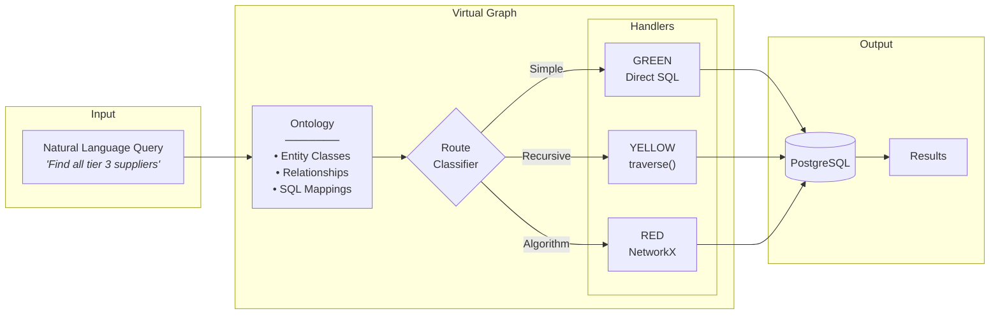

# Virtual Graph

**Graph-like queries over relational data using LLM reasoning.**

Virtual Graph enables graph traversal, pathfinding, and network analysis over existing PostgreSQL databases without migrating to a graph database.

---

## The Research Question

> Can an LLM agent system equipped with an ontology and tooling for complex queries (DAGs, recursion, etc.) on top of a relational database perform effectively versus implementing a graph database?

For enterprises with existing SQL infrastructure, this question is critical. Graph databases offer powerful query capabilities, but migration carries significant cost and risk.

---

## How It Works



**The core idea**: An ontology maps business concepts to SQL tables. Handlers generate efficient queries based on complexity. No graph database required.

Virtual Graph routes queries through three paths:

| Route | Complexity | Handler | Example |
|-------|------------|---------|---------|
| **GREEN** | Simple SQL | Direct query | "Find supplier Acme Corp" |
| **YELLOW** | Recursive traversal | `traverse()` | "Find all tier 3 suppliers" |
| **RED** | Network algorithms | NetworkX | "Cheapest route Chicago→LA" |

---

## Quick Navigation

| Section | Description | Start Here |
|---------|-------------|------------|
| **[Concepts](concepts/overview.md)** | Vision, architecture, when to use | [Overview](concepts/overview.md) |
| **[Workflow](workflow/overview.md)** | Three-phase process | [Workflow Overview](workflow/overview.md) |
| **[Supply Chain Example](examples/supply-chain/overview.md)** | Complete worked example | [Get Started](examples/supply-chain/setup.md) |
| **[Evaluation](evaluation/benchmark-results.md)** | Benchmarks, TCO, findings | [Results](evaluation/benchmark-results.md) |
| **[Reference](reference/api/handlers.md)** | API docs, history | [Handlers API](reference/api/handlers.md) |

---

## Two Audience Tracks

### For Domain Developers

Build graph-like query capabilities over your existing databases:

1. **Start with Concepts** → [Overview](concepts/overview.md) → [Architecture](concepts/architecture.md)
2. **Learn the Workflow** → [Ontology Discovery](workflow/ontology-discovery.md) → [Pattern Discovery](workflow/pattern-discovery.md)
3. **Follow the Example** → [Supply Chain Setup](examples/supply-chain/setup.md) → [Query Walkthroughs](examples/supply-chain/queries.md)

### For Research Evaluators

Assess whether the Virtual Graph approach meets your needs:

1. **Understand the Hypothesis** → [Concepts Overview](concepts/overview.md)
2. **Review Methodology** → [Evaluation Methodology](evaluation/methodology.md)
3. **Examine Results** → [Benchmark Results](evaluation/benchmark-results.md) → [TCO Framework](evaluation/tco-framework.md)

---

## Benchmark Results

Virtual Graph achieved **92% accuracy** on a 25-query benchmark:

| Route | Accuracy | Target | Status |
|-------|----------|--------|--------|
| GREEN (Simple SQL) | 88.9% | 100% | MISS |
| YELLOW (Traversal) | 100%* | 90% | **PASS** |
| RED (Network) | 85.7% | 80% | **PASS** |
| **Overall** | **92%** | 85% | **PASS** |

*Includes 5 queries correctly blocked by safety limits

**Key Findings:**

- Sub-10ms latency on all queries
- 88% cost reduction vs Neo4j migration
- Safety limits correctly prevent runaway queries

→ [Full Benchmark Results](evaluation/benchmark-results.md)

---

## Project Status

| Component | Status | Notes |
|-----------|--------|-------|
| Database Infrastructure | ✅ Complete | PostgreSQL 14, 15-table schema |
| Handler Core | ✅ Complete | traverse, pathfinding, network |
| Ontology System | ✅ Complete | LinkML format with VG extensions |
| Pattern Templates | ✅ Complete | 8 templates across 4 categories |
| Benchmark Suite | ✅ Complete | 25 queries, Neo4j comparison |
| Documentation | ✅ Complete | Full docs overhaul |

---

## Quick Start

```bash
# Clone repository
git clone https://github.com/anthropics/virt-graph.git
cd virt-graph

# Install dependencies
poetry install

# Start PostgreSQL
docker-compose -f postgres/docker-compose.yml up -d

# Run tests
poetry run pytest tests/test_gate1_validation.py -v
```

→ [Full Installation Guide](examples/supply-chain/setup.md)

---

## Links

- [GitHub Repository](https://github.com/anthropics/virt-graph)
- [API Reference](reference/api/handlers.md)
- [Project History](reference/history.md)
