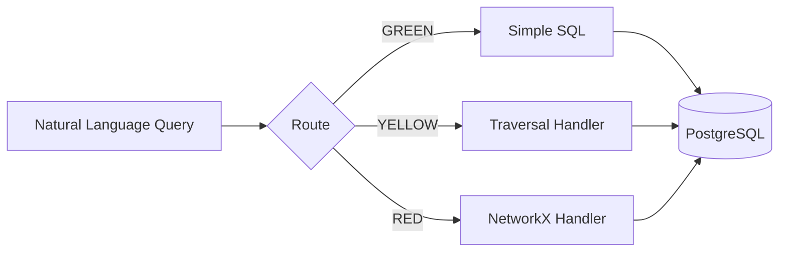

# Virtual Graph

**Graph-like queries over relational data using LLM reasoning.**

Virtual Graph enables graph-like queries over enterprise relational data without migrating to a graph database. The system uses an LLM to reason over SQL using a discovered ontology and learned SQL patterns.

## Key Hypothesis

For enterprises with existing SQL infrastructure, the Virtual Graph approach can deliver **80%+ of graph query capabilities** at a fraction of the migration cost.

## How It Works



### Query Routing

| Route | Description | Example |
|-------|-------------|---------|
| **GREEN** | Simple lookups/joins - direct SQL | "Find supplier ABC Corp" |
| **YELLOW** | Recursive traversal - BFS handler | "All tier 3 suppliers for Acme" |
| **RED** | Network algorithms - NetworkX | "Cheapest route from A to B" |

## Quick Start

```bash
# Start PostgreSQL
docker-compose -f postgres/docker-compose.yml up -d

# Install dependencies
poetry install

# Run tests
poetry run pytest
```

## Project Status

| Phase | Status | Description |
|-------|--------|-------------|
| Phase 1 | ✅ Complete | Foundation - Database + Handlers |
| Phase 2 | ✅ Complete | Discovery - Ontology + Schema Skill |
| Phase 3 | ✅ Complete | Query Paths - GREEN/YELLOW/RED |
| Phase 4 | ✅ Complete | Pattern Maturity |
| Phase 5 | ✅ Complete | Neo4j Baseline + Benchmark |
| Phase 6 | ✅ Complete | Evaluation + Documentation |

## Features

- **No Migration Required**: Query existing PostgreSQL data as a graph
- **Safety Limits**: Built-in guards prevent runaway queries
- **Frontier Batching**: Efficient traversal with one query per depth level
- **Schema Parameterized**: Handlers work with any table structure
