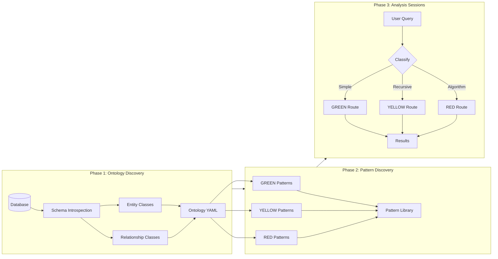

# Workflow Overview

Virtual Graph operates through a three-phase workflow that transforms raw database schemas into queryable graph semantics.

## The Three Phases



## Phase Summary

| Phase | Type | Frequency | Output |
|-------|------|-----------|--------|
| **Ontology Discovery** | Offline | Once per schema | `ontology/{schema}.yaml` |
| **Pattern Discovery** | Offline | Iterative | `patterns/raw/*.yaml` |
| **Analysis Sessions** | Interactive | Ongoing | Query results + insights |

## Phase 1: Ontology Discovery

**Goal**: Create a semantic map from business concepts to SQL tables.

**Process**:
1. Introspect database schema (tables, columns, FKs)
2. Identify entity classes (TBox) - things that exist
3. Identify relationship classes (RBox) - how things connect
4. Assign traversal complexity (GREEN/YELLOW/RED)
5. Validate and finalize

**Output**: LinkML ontology file with Virtual Graph extensions

```yaml
# Example: ontology/supply_chain.yaml
classes:
  Supplier:
    annotations:
      vg:table: suppliers
      vg:primary_key: id

  SuppliesTo:
    annotations:
      vg:edge_table: supplier_relationships
      vg:traversal_complexity: YELLOW
```

*For your domain: Run this once when setting up Virtual Graph on a new database.*

See [Ontology Discovery](ontology-discovery.md) for the detailed protocol.

## Phase 2: Pattern Discovery

**Goal**: Build a library of reusable query patterns.

**Process**:
1. Load ontology enumeration
2. Explore GREEN patterns (simple SQL)
3. Explore YELLOW patterns (recursive traversal)
4. Explore RED patterns (network algorithms)
5. Document cross-complexity combinations

**Output**: Pattern templates in `patterns/templates/`

```yaml
# Example: patterns/templates/traversal/tier_traversal.yaml
name: tier_traversal
complexity: YELLOW
handler: traverse
parameters:
  start_entity: Supplier
  direction: inbound
  max_depth: 10
```

*For your domain: Build iteratively as you explore queries. The library grows over time.*

See [Pattern Discovery](pattern-discovery.md) for the detailed protocol.

## Phase 3: Analysis Sessions

**Goal**: Interactive data exploration using graph-like queries.

**Process**:
1. Load ontology context
2. Receive user question
3. Classify query complexity
4. Match to pattern (if available)
5. Execute via appropriate route
6. Present results

**Workflow per query**:

```
User Question
      │
      ▼
┌─────────────┐
│  Classify   │
└──────┬──────┘
       │
   ┌───┴───┬───────┐
   │       │       │
   ▼       ▼       ▼
 GREEN   YELLOW   RED
   │       │       │
   ▼       ▼       ▼
  SQL   traverse  NetworkX
   │       │       │
   └───────┼───────┘
           │
           ▼
       Results
```

*For your domain: This is the primary usage mode - ongoing interactive sessions.*

See [Analysis Sessions](analysis-sessions.md) for the detailed protocol.

## Workflow Progression

### New Database Setup

```
Day 1:  Schema introspection → Draft ontology
Day 1:  Human review → Corrections → Final ontology
Day 1:  Initial GREEN patterns
Day 2:  YELLOW patterns exploration
Day 2:  RED patterns exploration (if applicable)
Day 2+: Analysis sessions begin
Ongoing: Pattern library grows from new queries
```

### Established Database

```
Each Session:
  1. Load ontology (automatic)
  2. User asks questions
  3. Queries routed appropriately
  4. Results returned
  5. New patterns recorded if useful
```

## Human-in-the-Loop Points

Each phase includes explicit pause points for human review:

| Phase | Pause Points |
|-------|--------------|
| Ontology Discovery | After schema summary, after TBox, after RBox, final review |
| Pattern Discovery | After each complexity phase (GREEN, YELLOW, RED, MIXED) |
| Analysis Sessions | Continuous - human drives the questions |

## Getting Started

1. **New to Virtual Graph?**
   - Start with [Ontology Discovery](ontology-discovery.md)
   - Work through the supply chain example

2. **Have an ontology already?**
   - Jump to [Pattern Discovery](pattern-discovery.md)
   - Build your query library

3. **Ready for analysis?**
   - Read [Analysis Sessions](analysis-sessions.md)
   - Start exploring your data

## Session Starters

Each phase has a prompt file you can use to start a fresh Claude session:

```bash
# Phase 1: Ontology Discovery
cat prompts/ontology_discovery.md

# Phase 2: Pattern Discovery
cat prompts/pattern_discovery.md

# Phase 3: Analysis Session
cat prompts/analysis_session.md
```

These prompts include the full protocol, so Claude knows exactly what to do.
